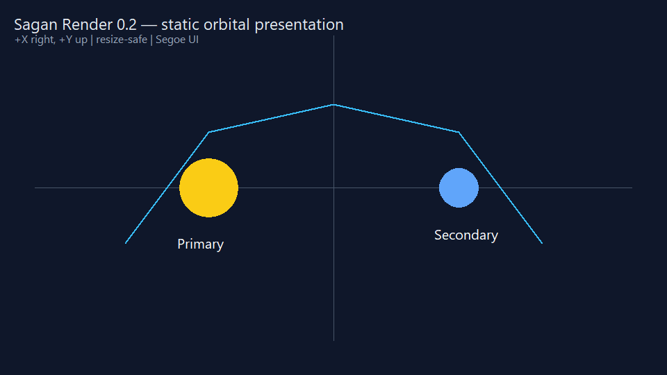
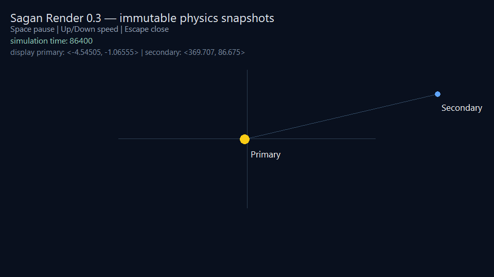
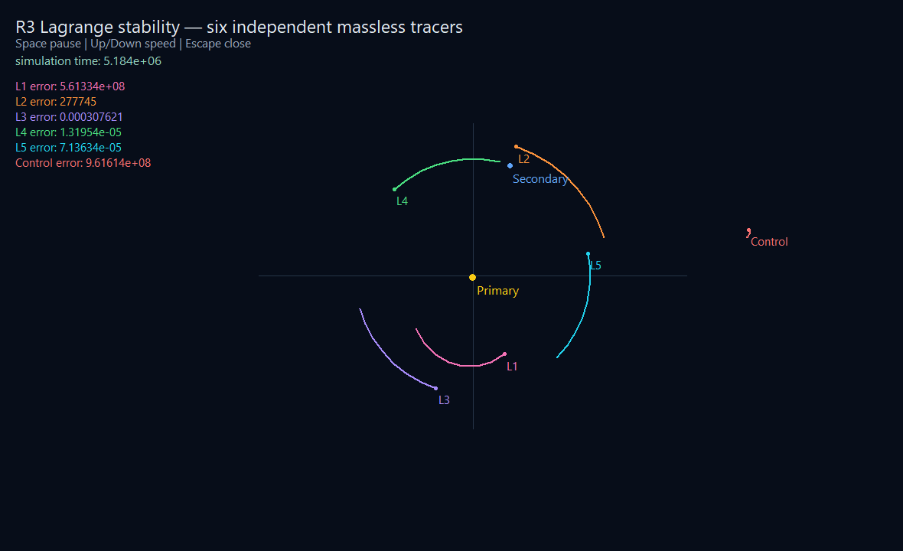

# Rendering library

!!! warning "Work-in-progress library"
    Version 0.5.1 implements the R0 single-window bridge, R1 basic 2D canvas,
    R2 snapshot animation support, and the keyboard and wheel input used by R3
    on Windows.
    It is not a general scene or UI system, and its public API may change
    before 1.0.

Rendering is intended to be a first-party Sagan core library integrated with
the language's mathematical and simulation vocabulary. It will require an
explicit import so non-graphical programs do not incur rendering dependencies
or runtime costs.

## Intended role

The library will eventually provide the supported path from Sagan simulation
data to visual output. Its public abstractions must be designed together with
real examples rather than inferred from the current compiler, AST visualization
features, or any particular graphics ecosystem.

The compiler's existing DOT, SVG, and interactive HTML AST renderers are
developer tools. They are not implementations or previews of the future Sagan
rendering library.

## Window and frame lifecycle

The independently versioned `sagan-render` package exports `open`, `poll`,
`clear`, `close`, `elapsed_seconds`, `key_pressed`, and `scroll_y` from
`render.window`. It
owns one resizable native window per process. Native handles remain private.
The current private backend uses the Windows API; this is not part of the
Sagan-facing contract and may be replaced by SDL3 without changing callers.

`open` validates positive dimensions and reports native setup failures through
the existing runtime-failure path. `poll` processes pending window events and
becomes false after a close request. `close` releases the window, back buffer,
and registration resources and is safe to call after the user closes the
window.

`elapsed_seconds()` reports monotonic wall time since `open`. `key_pressed`
consumes one press of `space`, `up`, `down`, or `r`; Escape requests a clean close
directly. `scroll_y` consumes accumulated vertical mouse-wheel movement, with
positive values for upward scrolling and negative values for downward scrolling.
These small primitives let an application schedule fixed simulation
steps independently of display frames. They do not make the renderer the owner
of simulation time or mutable physics state.

`clear` starts a frame by filling a resize-aware private back buffer. Drawing
operations modify that frame, and `present` copies it to the window. Callers
redraw every display frame; the renderer preserves the most recently presented
frame for native paint events.

## Basic 2D canvas

The `render.canvas` module exports:

- `set_view(center_x, center_y, pixels_per_unit)` for a centered orthographic
  world-to-screen transform;
- `circle(x, y, radius, red, green, blue)` for filled world-space circles;
- `line(start_x, start_y, end_x, end_y, width, red, green, blue)` for
  world-space line segments;
- `text(x, y, value, point_size, red, green, blue)` for world-positioned text;
- `text_screen(x, y, value, point_size, red, green, blue)` for fixed overlays;
  and
- `present()` to display the completed frame.

World coordinates use +X right and +Y up. The view center maps to the current
client-area center, so resizing keeps the world origin centered. Circle radii
scale with `pixels_per_unit`; line widths and screen text positions are physical
pixels. Colors are integer RGB channels from 0 through 255. Coordinates, scale,
radii, widths, point sizes, and colors are checked before drawing. Version 0.4
does not yet expose alpha, clipping, rotation, font selection, paths as one
object, or retained drawables.

Text uses the Windows system `Segoe UI` font with ClearType quality. Point sizes
use the drawing device's current DPI. No font file is distributed at R1; a
portable backend must establish an equivalent font-loading contract.

## Demos and verification

From a source checkout with the documented MSYS2 UCRT64 toolchain, run:

```bash
make window-demo
make shape-text-demo
make two-body-demo
make lagrange-demo
```

For the animated project, `make two-body-demo` now invokes the normal compiler
path. You can run that same manifest-backed project directly:

```bash
sagan --run-package examples/two_body_demo
```

Its `sagan.toml` declares `[application] mode = "windowed"`. On Windows, with
Sagan's file association installed, double-click
`examples/two_body_demo/src/main.sagan` to launch it without a terminal.
The installed release and portable ZIP also include this example under
`examples/two_body_demo`; run that copy with `sagan --run-package` or launch its
entry file from Explorer. An unconfigured or non-rendering Sagan program keeps
the ordinary console behavior.

The command compiles the Sagan package and its private native bridge, then opens
a resizable 960 by 540 solid blue-gray window. Close it with the standard
window close button. `make window-demo-test` uses the private
`SAGAN_RENDER_AUTOCLOSE_MS` smoke-test setting to exercise the same lifecycle
without waiting for input. `make shape-text-demo` opens the R1 static
presentation with two bodies, axes, line segments, world labels, and a screen
legend. `make shape-text-demo-test` captures and validates the same frame as a
960 by 540 top-down BMP. `make two-body-demo` consumes immutable snapshots from
`sagan-physics` 0.3.0 and animates the real two-body solution. Space pauses,
Up/Down change playback speed, and Escape or the close button exits cleanly.
The demo caps a single real-time frame contribution at 0.25 seconds to avoid a
large simulation catch-up after a debugger stop or window stall.





`make two-body-demo-test` runs the same executable under two deterministic
display schedules: 100 frames at 20 milliseconds and 20 frames at 100
milliseconds. Both represent two real seconds and must produce the identical
fixed-step snapshot at simulation time 172800 seconds. The test also captures
and validates the displayed 960 by 540 frame. The deterministic timing controls
are private test environment settings, not public Sagan APIs.
The window shows elapsed simulation time in days and the selected playback
rate in simulated days per real second. The rate remains selected while paused;
no simulation time advances until playback resumes.

`make lagrange-demo` reuses the same renderer and frame scheduler for
`sagan-physics` 0.3.0's restricted-three-body snapshots. It displays the two
massive primaries, L1 through L5, and an off-point control as eight distinctly
colored bodies. Every body has an eight-sample matching-color trail recorded
at six-hour simulation intervals, and each tracer has a matching numeric
rotating-frame error.
The demo opens paused at five simulated days per real second. Space toggles
playback, Up/Down change the rate up to 40 simulated days per real second, and
the mouse wheel changes the orthographic
scale from 250 through 20,000 kilometers per pixel. The overlay shows elapsed
days, the selected simulation rate, and the current scale. Error readouts use
an explicit conversion to kilometers, so unit-bearing output says `kilometer`
instead of a misleading `meter / kilometer` ratio. R restores the physical initial state,
pauses, and clears the trails without changing the selected rate. The representative 60-day
snapshot visibly distinguishes the small L4/L5 errors from the unstable L1
and off-point control without claiming that every Lagrange point is stable.



`make lagrange-demo-test` runs 600 frames at 20 milliseconds and 120 frames at
100 milliseconds. Both schedules must produce the same 60-day physics result.
It also verifies that reset preserves a doubled playback rate and validates the
captured 1180 by 720 frame. Trail sampling is a presentation concern and does
not feed state back into the physics solver.

`make solar-lagrange-demo` keeps the same Earth-Moon-centered Lagrange view,
colors, trails, rotating polygonal Lagrange guide, controls, and error
presentation while adding the Sun as a third mutually gravitating massive
body. The guide is reconstructed from the current perturbed Earth-Moon axis,
so it remains the live ideal reference rather than a fixed screen decoration.
All six massless tracers feel the Sun, Earth, and Moon. A gold direction marker
keeps the off-screen Sun legible, and a heliocentric inset shows the Earth-Moon
group orbiting the Sun without shrinking the local Lagrange geometry to a
pixel. Its overlay also separates elapsed simulation days from the selected
simulated-days-per-real-second rate and displays tracer errors in kilometers.
Like the restricted-three-body window, it opens paused; press Space to start
or pause the simulation.

The deterministic solar window fixture advances 600 20-millisecond frames to
the same 60-day state as the headless fixture and captures the rendered frame.
At that point the model reports approximately 39,844 km of L4 error and
48,369 km of L5 error. These values demonstrate the difference from the ideal
circular restricted-three-body model; the planar circular setup is not an
ephemeris-accuracy claim. Run the check with:

```bash
make solar-lagrange-demo-test
```

Version 0.5.1 supports Windows only and links the system `user32` and `gdi32`
libraries. The compiler locates the private native bridge from the resolved,
locked `sagan-render` package; a missing installed bridge or package index
produces a build error identifying the missing input. The demo statically links
its GCC/C++
runtime support, so the resulting executable does not require MSYS2 runtime
directories on `PATH`. It has no SDL or GPU dependency yet.
Text uses Windows' Segoe UI system font; no separate font file is bundled.
The installed first-party catalog declares compiler compatibility `^4.0.0` for
the current development language. This range is catalog metadata; the renderer
retains its independent package version, 0.5.1.

## Relationship to math and physics

Rendering will use the automatically available math foundation. It should be
able to visualize data produced by physics, but physics remains a separate,
explicitly imported core library. Concrete dependency direction, shared scene
or geometry types, coordinate conventions, and runtime integration remain
open.

## Documentation required before release

The completed section must define supported platforms and backends, imports,
package organization, public APIs, coordinate and color conventions, resource
ownership, frame lifecycle, error behavior, performance expectations,
headless operation, examples, and interoperability with math and physics.

See the [standard-library status](status.md) for the current decision boundary.
